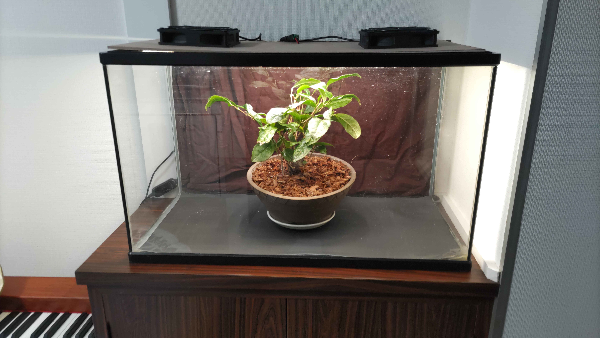
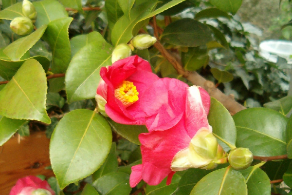
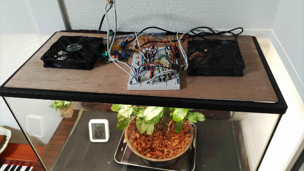

# Miniature Smart Greenhouse

[`日本語のREADMEはこちら。`](Docs/README_JP.md)

ESP32-based environmental monitoring and control system for a small enclosed terrarium / greenhouse. Designed to help maintain plant health in indoor environments (including homes with pets). Built using off-the-shelf components and simple, explicit state machines. Safety defaults are configured such that the system fails dark.


---

## Status

Early development / hardware bring-up phase (Jan 2026).

See  [`TODO`](Docs/TODO.md) for current progress.

---

## Goals

### Realistic v1.0 Feature Set

#### Monitor

- Air temperature
- Air humidity
- Soil temperature
- Soil moisture
- Time of day

#### Control

- Ventilation fans (PWM, multi-level)
- Grow lights (time-based, temperature-limited)
- Soil heating pad (PWM, hysteresis-controlled)
- Status LEDs (soil moisture indicator)

#### Safety

- All actuators default to **OFF** on boot or sensor fault.

---

## Deferred Features

### Possible v2.0 Features

#### Actuators / System

- Automatic watering system with low water tank alert
- Active cooling system / active humidity control

#### Enclosure

- Wooden enclosure for tank base and lid
- Improved lid and sensor integration

#### Web Interface

- Live sensor readouts
- Runtime adjustment of control ranges without reflashing

---

## Target Plant

**Current tuning and validation target:**

Wild Camellia (*Camellia japonica* var. *japonica*)


> All thresholds are compile-time definitions and are expected to change.

- Ideal air temperature: 10–22 °C
- Ideal humidity: 50–70 %
- Ideal soil temperature: 12–20 °C
- Ideal soil moisture: 30–45 %

---

## Hardware Overview

Built using readily available, off-the-shelf components.

### Controller

- ESP32-C3 Super Mini

### Power

- 12 V DC supply
- LM2596 buck converter (12 V → 5 V)

### Sensors

- DS18B20 — soil temperature (OneWire)
- SHT31-D — air temperature and humidity (I²C)
- CAP-SW-12 — soil moisture percentage (ADC)
- DS1307 — real-time clock (I²C)

### Actuators

- 12 V LED grow light strip (MOSFET + PWM)
- 5 V ventilation fans ×2 (MOSFET + PWM, flyback diodes)
- USB soil heating pad (MOSFET + thermal fuse)
- Status LED (GPIO-driven)

## Current Implementation

- Current implementation uses breadboard and is unenclosed while testing
- Enclosure / more permanent perfboard set as v2 feature
  
---

## Software Structure

Single-loop, state-driven design.

### High-Level Flow

```
read sensors
   ↓
update internal states
   ↓
run actuators based on state
   ↓
delay / idle
```


---

## Safety Notes

### Hardware

- Heating pad includes a thermal fuse as a mechanical safety cutoff
- Fans include flyback diodes to protect switching circuitry

### Software

- Explicit hysteresis in control logic
- All outputs default to OFF on boot
- Sensor read failures default to safe (OFF) states
- No watchdog or autonomous fault recovery implemented as of v1.0

---

## Further Reading

- [`PARTS_LIST`](docs/PARTS_LIST.md) — hardware components 
- [`SCHEMATIC`](docs/SCHEMATIC.pdf) — wiring and layout details
- [`DEVELOPMENT_NOTES`](docs/DEVELOPMENT_NOTES.md) — troubleshooting history / future notes

